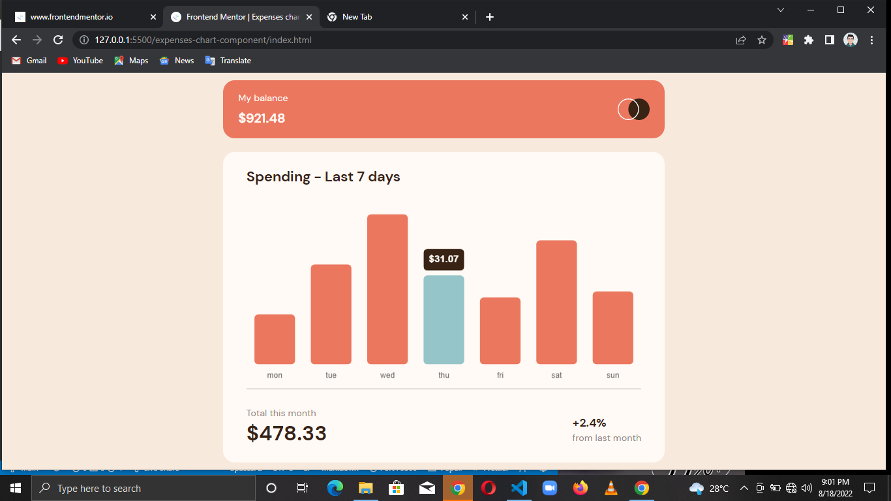

# Frontend Mentor - Expenses chart component solution

This is a solution to the [Expenses chart component challenge on Frontend Mentor](https://www.frontendmentor.io/challenges/expenses-chart-component-e7yJBUdjwt). Frontend Mentor challenges help you improve your coding skills by building realistic projects.

## Table of contents

- [Overview](#overview)
  - [The challenge](#the-challenge)
  - [Screenshot](#screenshot)
- [My process](#my-process)
  - [Built with](#built-with)
  - [What I learned](#what-i-learned)
- [Author](#author)

## Overview

### The challenge

Users should be able to:

- View the bar chart and hover over the individual bars to see the correct amounts for each day
- See the current day’s bar highlighted in a different colour to the other bars
- View the optimal layout for the content depending on their device’s screen size
- See hover states for all interactive elements on the page

### Screenshot



## My process

### Built with

- Semantic HTML5 markup
- CSS custom properties
- Flexbox
- CSS Grid
- Vanilla JS
- jQuery
- [Chart.js](https://chartjs.org/) - Chart Library

### What I learned

`I learnt a whole lot 😤 seeing as it's the first time I'm using a library other than jQuery, though I'm mostly proud of the snippet below:`

```
 tooltip: {
          backgroundColor: darkBrown,
          displayColors: false,
          titleAlign: "center",
          titleColor: paleOrange,
          titleMarginBottom: 0,
          titleFont: {
            size: 15,
            weight: 550,
          },
          padding: 8,
          callbacks: {
            title: (context) => {
              return `$${context[0].dataset.data[context[0].dataIndex]}`;
            },
            label: () => {
              return "";
            },
          },
          yAlign: "bottom",
          xAlign: "center",
          caretSize: 0,
          caretPadding: 8,
        }
```

## Author

- LinkedIn - [Chisom Udonsi](https://www.linkedin.com/in/chisom-udonsi-45196b216)
- Frontend Mentor - [@TheAce74](https://www.frontendmentor.io/profile/TheAce74)
- Twitter - [@TheAce74](https://www.twitter.com/TheAce74)