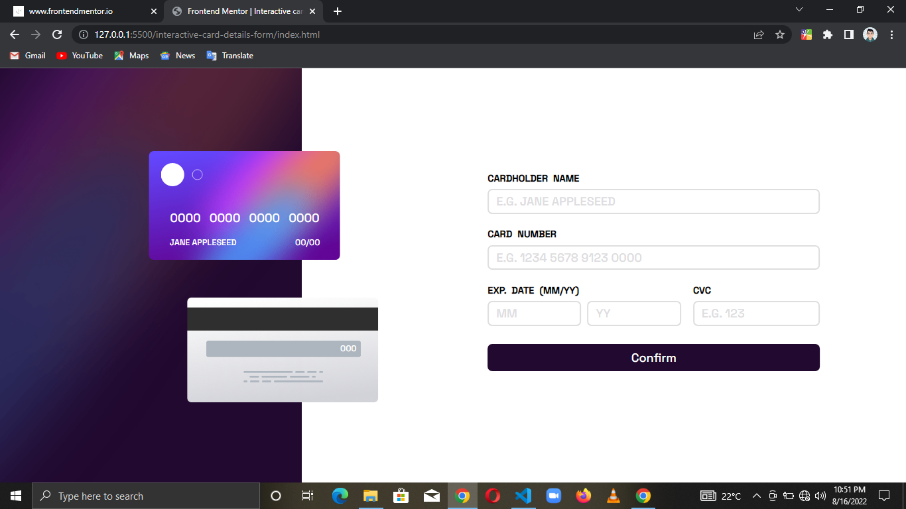

# Frontend Mentor - Interactive card details form solution

This is a solution to the [Interactive card details form challenge on Frontend Mentor](https://www.frontendmentor.io/challenges/interactive-card-details-form-XpS8cKZDWw). Frontend Mentor challenges help you improve your coding skills by building realistic projects.

## Table of contents

- [Overview](#overview)
  - [The challenge](#the-challenge)
  - [Screenshot](#screenshot)
- [My process](#my-process)
  - [Built with](#built-with)
  - [What I learned](#what-i-learned)
- [Author](#author)

## Overview

### The challenge

Users should be able to:

- Fill in the form and see the card details update in real-time
- Receive error messages when the form is submitted if:
  - Any input field is empty
  - The card number, expiry date, or CVC fields are in the wrong format
- View the optimal layout depending on their device's screen size
- See hover, active, and focus states for interactive elements on the page

### Screenshot



## My process

### Built with

- HTML5
- CSS3
- Flexbox
- CSS Grid
- Vanilla JS
- jQuery

### What I learned

```CSS
.proud-of-this-css {
  border-image: linear-gradient(
    to right,
    rgb(100, 72, 254) 0%,
    rgb(96, 5, 148) 100%
  );
  border-image-slice: 1;
}

Still trying to wrap my head around the "slice" part though 😅
```

## Author

- LinkedIn - [Chisom Udonsi](https://www.linkedin.com/in/chisom-udonsi-45196b216)
- Frontend Mentor - [@TheAce74](https://www.frontendmentor.io/profile/TheAce74)
- Twitter - [@TheAce74](https://www.twitter.com/TheAce74)
