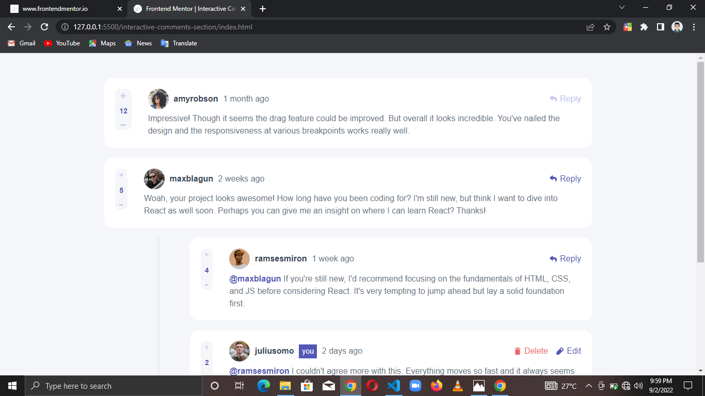

# Frontend Mentor - Interactive comments section solution

This is a solution to the [Interactive comments section challenge on Frontend Mentor](https://www.frontendmentor.io/challenges/interactive-comments-section-iG1RugEG9). Frontend Mentor challenges help you improve your coding skills by building realistic projects. 

## Table of contents

- [Overview](#overview)
  - [The challenge](#the-challenge)
  - [Screenshot](#screenshot)
- [My process](#my-process)
  - [Built with](#built-with)
  - [What I learned](#what-i-learned)
- [Author](#author)

## Overview

### The challenge

Users should be able to:

- View the optimal layout for the app depending on their device's screen size
- See hover states for all interactive elements on the page
- Create, Read, Update, and Delete comments and replies
- Upvote and downvote comments
- See the updates they previously made on the site whenever they visit again
- See the correct date/time they made the said updates

### Screenshot



## My process

### Built with

- HTML5
- CSS3
- Flexbox
- Vanilla JS

### What I learned

```
Didn't really learn anything new but I got to use some stuff for the first time like
before(), replaceChild(), Array.from() and some others that for some reason I can't remember.

This is my favorite project, I did a lot of stuff I didn't know I could do before. It really broadened my view on certain things, and heightened my imagination and logic

Just so you know, when you use Array.from on HTML live collections, the array elements keep reference to their corresponding DOM predecessors; and the event object is writable-ish.

Oh and I added a little validation for your viewing pleasure 😏

One more thing, my deepest apologies to those that would want to learn from this project, I know that my approach was a teensy bit overkill 😅
```

## Author

- LinkedIn - [Chisom Udonsi](https://www.linkedin.com/in/chisom-udonsi-45196b216)
- Frontend Mentor - [@TheAce74](https://www.frontendmentor.io/profile/TheAce74)
- Twitter - [@TheAce74](https://www.twitter.com/TheAce74)