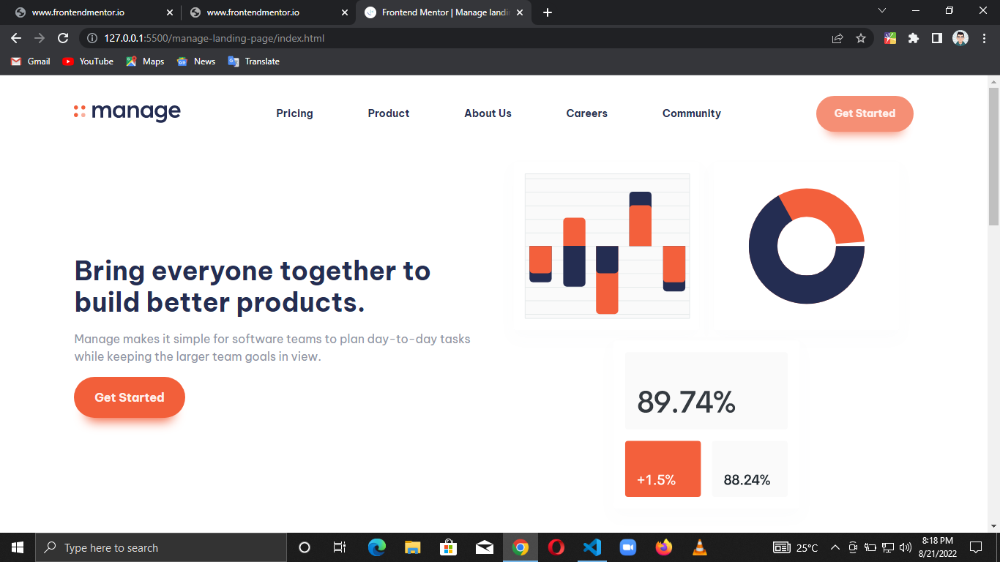

# Frontend Mentor - Manage landing page solution

This is a solution to the [Manage landing page challenge on Frontend Mentor](https://www.frontendmentor.io/challenges/manage-landing-page-SLXqC6P5). Frontend Mentor challenges help you improve your coding skills by building realistic projects.

## Table of contents

- [Overview](#overview)
  - [The challenge](#the-challenge)
  - [Screenshot](#screenshot)
- [My process](#my-process)
  - [Built with](#built-with)
  - [What I learned](#what-i-learned)
- [Author](#author)
- [Acknowledgement](#acknowledgement)

## Overview

### The challenge

Users should be able to:

- View the optimal layout for the site depending on their device's screen size
- See hover states for all interactive elements on the page
- See all testimonials in a horizontal slider
- Receive an error message when the newsletter sign up `form` is submitted if:
  - The `input` field is empty
  - The email address is not formatted correctly

### Screenshot



## My process

### Built with

- Semantic HTML5 markup
- CSS custom properties
- Flexbox
- CSS Grid
- Desktop-first workflow
- A11Y slider library

### What I learned

Phew 😌, I learnt a ton of new stuff and mostly on accessibility. Without further ado:

```html
aria-labelledby
aria-controls
aria-expanded
aria-live
```

```css
.never-thought-of-this-before {
  ul[role="list"],
  ol[role="list"] {
    list-style: none;
  }
}
The selector above opened my mind to more emmet capabilities as well😉

The "columns" property as well, though I didn't use it
```

```js
Nothing to see here...
Though I had fun playing around with yet another library😁
```

## Author

- LinkedIn - [Chisom Udonsi](https://www.linkedin.com/in/chisom-udonsi-45196b216)
- Frontend Mentor - [@TheAce74](https://www.frontendmentor.io/profile/TheAce74)
- Twitter - [@TheAce74](https://www.twitter.com/TheAce74)

## Acknowledgement

My special thanks to `Kevin Powell`, The King of CSS 👑, most of the new stuff I learnt were all thanks to him

Oh yeah, I almost forgot😅, please forgive my naming scheme inconsistency🥺
I'm still working on my custom scheme, the BEM doesn't really sit right with me for minor projects like this
